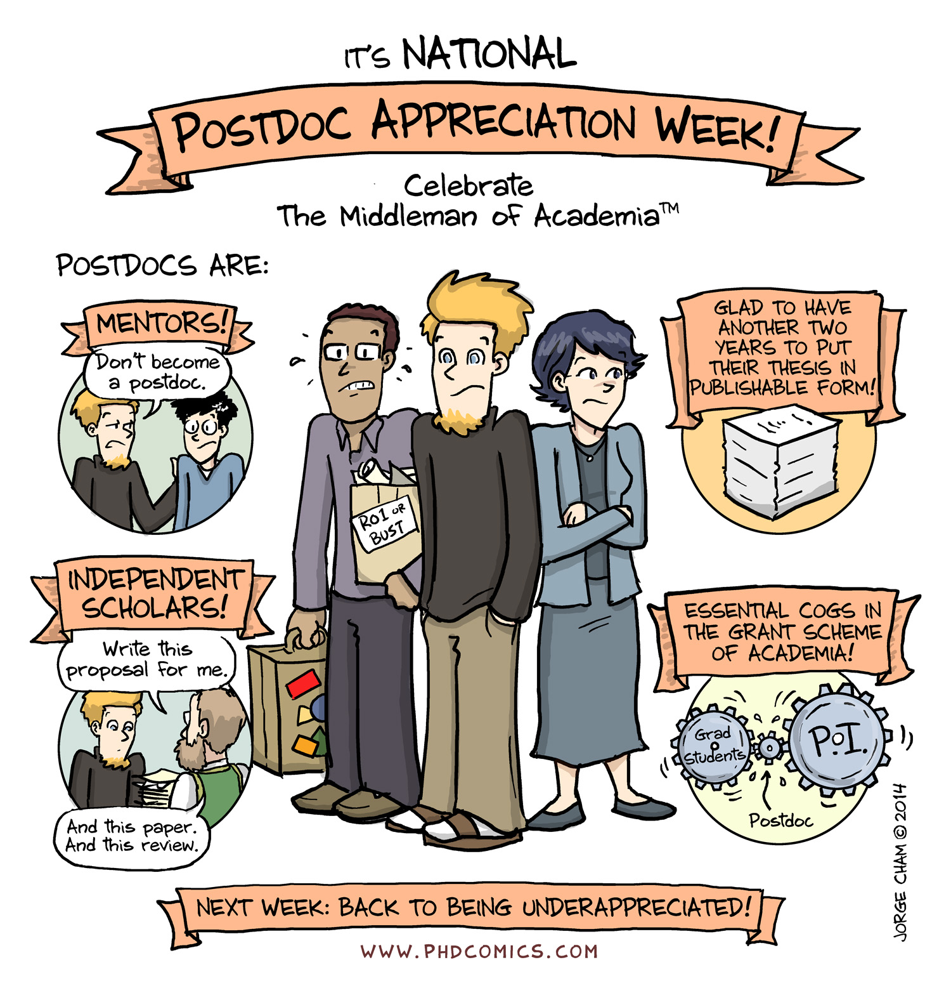

## Postdoc appreciation week

:::: {.columns}

::: {.column width="50%"}

:::

::: {.column width="50%"}
> This September, Aarhus University will celebrate Postdoc Appreciation Week (PAW), a week dedicated to recognising the valuable contributions of postdoctoral researchers and strengthening connections across the AU community.

[AU Postdoc Appreciation Week](https://health.medarbejdere.au.dk/en/display/artikel/postdoc-appreciation-week-16-18-september)

:::

::::

## Academia's drudge labourers {.quote}

> The data "paint postdocs as academia's drudge labourers: overworked, underpaid, appointed on precarious short-term contracts and lacking recognition for their efforts" [@nordling2023optimism].

> "A distinctive feature of today's academia is its hypercompetitive environment and culture, which often leads to aggressive and harmful working environments. Postdoctoral researchers, in particular, are under immense pressure to continually compete and perform at extreme levels" [@eurodoc2025].

<!-- > Post-doctoral researchers often find themselves in a "career limbo" that may persist for decades, "a long-term holding pattern of short, fixed-term contracts offering little job security and sparse benefits, poor compensation, high workloads, poor resources and support" [@eurodoc2025]. -->

## The scale of the problem

A 2026 meta-analysis pooling 228 samples and 138,446 early-career researchers found that:

- 29.9% report elevated psychological distress across outcomes
- depressive symptoms roughly two to three times, and anxiety symptoms three to five times, higher than in age-matched general-population samples [@dreisoerner2026mentalhealth]

## A structural pattern

- Prevalence and severity were comparable across gender, country, discipline, and career stage
- Small but significant effects for age and prior mental-health history
- Most frequently cited driver: a mismatch between the growing number of PhD graduates and the limited number of permanent academic positions [@dreisoerner2026mentalhealth]

## What satisfies and what doesn't

| Most satisfied with | % satisfied | Least satisfied with | % dissatisfied |
|---|---|---|---|
| Interest in the work | 75% | Job security | 56% |
| Degree of independence | 73% | Career-advancement opportunities | 49% |
| Interesting projects | 72% | | |

The pattern has held since 2020: postdocs like the work itself and dislike its stability [@researchNaturePostDoctoralSurvey2023].

<!-- FIGURE: Nature Postdocs Survey 2023_report_v1.pptx.pdf, p. 13 ("Postdocs are most satisfied with their interest in their work") and p. 14 ("Postdocs are least satisfied with their job security") — paired bar charts -->

## The puzzle {.statement}

65% of postdocs plan to base their career in academia. It is "extremely unlikely that 65% will end up in tenured or in long-term academic positions in their fields" [@nordling2023optimism].

{fig-align="center" width="70%" .nostretch style="margin-top: 1em;"}

# Europe and the Nordics

## The contract treadmill

:::: {.columns}

::: {.column width="50%"}

- 41.5% of European postdocs have already held three or more temporary research contracts
- 78.7% have less than two years left on their current one
- Only 1.2% hold a permanent contract [@eurodoc2025]

:::

::: {.column width="50%"}
{fig-align="center" width="90%" .nostretch }

:::

::::
<!-- FIGURE: Eurodoc-Postdoc-Survey-Report-2025.pdf, Figure 13 (p. 42) — bar charts of a) number of prior temporary contracts and b) years remaining on current contract -->

## Mobility as the default

:::: {.columns}

::: {.column width="50%"}

- 74.4% of European postdocs have lived in two or more countries since their master's degree [@eurodoc2025]
- 54% of Nature's respondents have moved country to take up a postdoc [@researchNaturePostDoctoralSurvey2023]
- Mobility is uneven: postdocs in Northern and Western Europe move the most, while 55.8% of those in Southern Europe stay at the institution where they did their PhD [@eurodoc2025]

:::

::: {.column width="50%"}

{fig-align="center" width="100%" .nostretch }

:::

::::

<!-- FIGURE: Eurodoc-Postdoc-Survey-Report-2025.pdf, section 3.1 (p. 42) — no numbered figure in the main text; the appendix tables for Q7 (institutional mobility) and Q35 (international mobility) break this down by region, field, and academic age if a chart is needed -->

## The two-body problem {.quote}

16% of European postdocs live apart from their partner or commute between countries for work [@eurodoc2025].

> "We have one big move left. We won't move any more for postdocs," said Manuel Chevalier, after eight years of postdocs in three countries [@nordling2023thirties].

{fig-align="center" width="60%" .nostretch style="margin-top: 0.1em;"}

## Mentorship and career support

- Only 23% of European postdocs feel their institution gives them enough guidance on career options [@eurodoc2025]
- 36.9% report no career-support office at all; another 23.4% don't know if one exists [@eurodoc2025]

<!-- FIGURE: Eurodoc-Postdoc-Survey-Report-2025.pdf, Figure 24 (p. ~55) — perceived availability of career guidance, and Figure 25 (p. ~56) — availability of a career-support office -->

## Mental health and work-life balance {.smaller}

:::: {.columns}

::: {.column width="50%"}
- 52% of postdocs have considered leaving science because of anxiety, depression, or related concerns [@researchNaturePostDoctoralSurvey2023]
- In Europe, 52.9% report an imbalance between work and non-work life; 29% rate their balance as bad or very bad [@eurodoc2025]
- Among those most affected, reasons cluster around precarity: uncertain job opportunities (58.5%), temporary contracts (58.6%), and lack of stable income (41.9%) [@eurodoc2025]

:::

::: {.column width="50%"}
{fig-align="center" width="80%" .nostretch }

:::

::::
<!-- FIGURE: Eurodoc-Postdoc-Survey-Report-2025.pdf, Figure 37 (p. ~66) — pie chart of respondents' perceived work-life balance -->

## What stable employment could look like

- Standard employment contracts of a reasonable minimum length, such as two years or longer, rather than serial short-term renewal [@eurodoc2025]
- Mandatory Sustainable Career Plans for research institutions, modeled on the European Commission's Gender Equality Plans [@eurodoc2025]

# Aarhus University

## Junior VIP and PhD: a job-category gap

At AU, "Junior VIP" covers Assistant Professors, Postdocs, and Researchers, the same career band as Eurodoc's respondents [@auwpa2025]:

| | Senior VIP | Junior VIP | Ph.D. | Total |
|---|---|---|---|---|
| Happy with job prospects | 3.7 | **3.2** | 3.5 | 3.6 |
| Motivated and engaged | 4.2 | **4.0** | 4.1 | 4.1 |

<small>n = 7,172, 78% response rate.</small>

## Junior VIP and PhD: a job-category gap (continued)

| | Senior VIP | Junior VIP | Ph.D. | Total |
|---|---|---|---|---|
| Task/time balance | 3.0 | 3.5 | 3.4 | 3.5 |
| Rarely stressed to the point of unwellness | 3.3 | 3.4 | **3.2** | 3.6 |

Junior VIP report the lowest job-prospect satisfaction of any staff category at AU; PhD students report the lowest stress score.

<!-- FIGURE: APV_2025_-_Aarhus_Universitet_-_2025_(_8_17_26).pdf, pp. 42-45 ("Results according to job categories") — full job-category comparison tables -->

## The under-40 pattern

Broken down by age, job-prospect satisfaction dips in the 30-39 band specifically, below both the under-30 and the 40-49 groups, before recovering with seniority [@auwpa2025]:

| | Under 30 | 30-39 | 40-49 | 50-59 | 60+ | Total |
|---|---|---|---|---|---|---|
| Happy with job prospects | 3.6 | **3.4** | 3.6 | 3.7 | 3.9 | 3.6 |

This mirrors qualitative reporting elsewhere that postdocs in their thirties are more negative than those under 30 about job prospects, job security, and work-life balance [@nordling2023thirties].

<!-- FIGURE: APV_2025_-_Aarhus_Universitet_-_2025_(_8_17_26).pdf, pp. 46-49 ("Results according to age") — full age-group comparison tables -->

# ANIVET

## The local psychological environment

Two of four faculty-specific items score below the department's overall average [@huswpa2025]:

- 3.2 for the department working with the psychological work environment "in a relevant manner", the lowest-scoring item
- 3.3 for feeling adequately supported to pursue external funding without undue stress

<!-- FIGURE: APV_2025_-_1037_Institut_for_Husdyr-_og_Veterin_rvidenskab_-_2025_(_8_12_26).pdf, p. 19 ("Faculty specific questions") -->

## Junior VIP and PhD in the department

The Junior VIP dip is sharper locally than at AU overall [@huswpa2025]:

| | Senior VIP | Junior VIP | Ph.D. | Total |
|---|---|---|---|---|
| Motivated and engaged | 4.3 | **3.8** | 4.3 | 4.1 |
| Rarely stressed to the point of unwellness | 3.2 | **3.1** | 3.3 | 3.4 |
| Receive information on decisions | 3.4 | 3.4 | 3.9 | 3.3 |

Junior VIP is the only group markedly less motivated than the rest of the department (3.8 vs. 4.1-4.3 elsewhere) and reports the lowest stress score.

<small>Source: ANIVET WPA 2025, "Results according to job categories," pp. 48-49. n = 187, 79% response rate.</small>

<!-- FIGURE: APV_2025_-_1037_Institut_for_Husdyr-_og_Veterin_rvidenskab_-_2025_(_8_12_26).pdf, pp. 48-50 ("Results according to job categories") -->

## The under-40 pattern in the department

By the 30-39 band, before anyone in the department turns 40, scores on information flow, recognition, and workload have already fallen from the under-30 level and stay low [@huswpa2025]:

| | Under 30 | 30-39 | 40-49 | 50-59 | 60+ | Total |
|---|---|---|---|---|---|---|
| Receive information on decisions | 3.8 | **3.2** | 3.2 | 3.2 | 3.3 | 3.3 |
| Task/time balance | 3.4 | 3.0 | **2.7** | 2.9 | 3.0 | 3.0 |
| Feel sufficiently recognised | 4.0 | 3.4 | **3.3** | 3.9 | 3.5 | 3.6 |

<small>Source: ANIVET WPA 2025, "Results according to age," pp. 51-53.</small>

<!-- FIGURE: APV_2025_-_1037_Institut_for_Husdyr-_og_Veterin_rvidenskab_-_2025_(_8_12_26).pdf, pp. 51-53 ("Results according to age") -->

## The open question {.question}

Structural, not individual: what can universities do?

## References

::: {#refs}
:::

## Thank you
